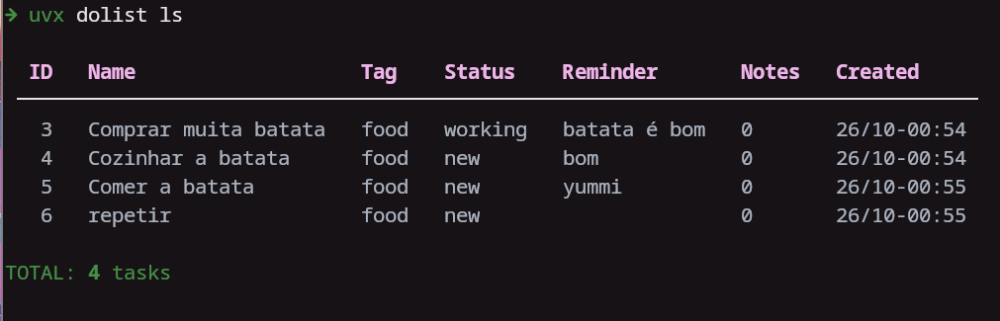
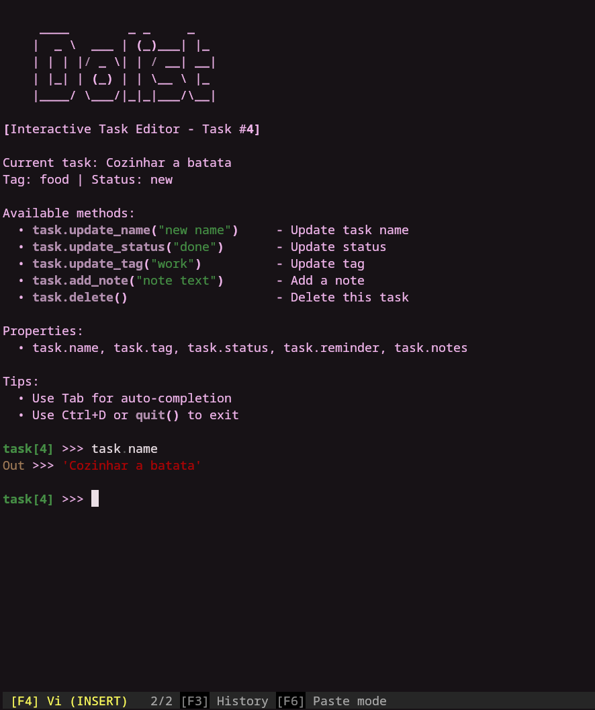
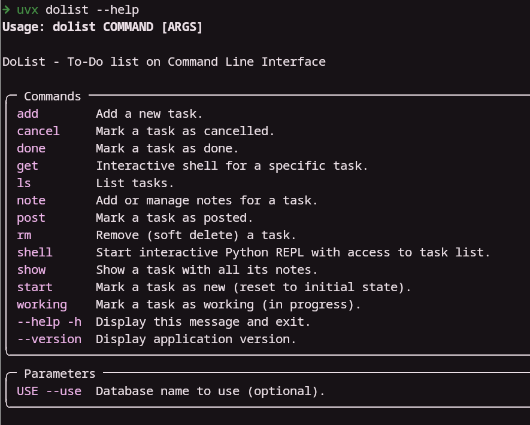

DoList
======

     ██████████            ████   ███           █████   
    ░░███░░░░███          ░░███  ░░░           ░░███    
     ░███   ░░███  ██████  ░███  ████   █████  ███████  
     ░███    ░███ ███░░███ ░███ ░░███  ███░░  ░░░███░   
     ░███    ░███░███ ░███ ░███  ░███ ░░█████   ░███    
     ░███    ███ ░███ ░███ ░███  ░███  ░░░░███  ░███ ███
     ██████████  ░░██████  █████ █████ ██████   ░░█████ 
    ░░░░░░░░░░    ░░░░░░  ░░░░░ ░░░░░ ░░░░░░     ░░░░░  

To Do list on Command Line Interface

Manage to-do list on a shell-based interface with beautiful tables and optional TUI mode. Stores your to-do locally in a SQLite database.

optionally use your Dropbox to store the database


## ✨ Features

- 🎨 **Modern CLI** powered by [Cyclopts](https://github.com/BrianPugh/cyclopts) with type hints
- 📊 **Beautiful Tables** using [Rich](https://github.com/Textualize/rich) library
- 🖥️ **Interactive TUI Mode** with [Textual](https://github.com/Textualize/textual) for graphical terminal interface
- 🐍 **Enhanced Python REPL** with [ptpython](https://github.com/prompt-toolkit/ptpython) featuring syntax highlighting and auto-completion
- ✅ **Data Validation** with [Pydantic](https://github.com/pydantic/pydantic) models
- 🗄️ **SQLite Database** for local task storage
- 🏷️ **Tag Support** to organize tasks
- 📝 **Notes** on tasks
- ⏰ **Smart Reminders** with flexible natural language parsing and background service
- 🔔 **Desktop Notifications** for due reminders (with custom handler support)
- 🔧 **Systemd Integration** for automatic reminder service
- 💾 **Multiple Databases** support

## Requirements

- Python 3.10 or higher
- [uv](https://docs.astral.sh/uv/) package manager (recommended)

## Installation

### Option 1: Using uvx from PyPI (⭐ Recommended)

The easiest way to use DoList is with `uvx` - no installation or cloning needed:

```bash
# Run dolist commands directly from PyPI
uvx dolist --help
uvx dolist add "My first task"
uvx dolist ls

# Launch the interactive TUI
uvx dolist
```

This will automatically download and run the latest version from PyPI each time.

### Option 2: Using uvx from GitHub

Run the latest development version directly from GitHub:

```bash
# Run dolist commands from GitHub
uvx --from git+https://github.com/rochacbruno/dolist dolist --help
uvx --from git+https://github.com/rochacbruno/dolist dolist add "My first task"
uvx --from git+https://github.com/rochacbruno/dolist dolist ls
```

### Option 3: Install with uv/pip

For permanent installation:

```bash
# Install from PyPI
uv pip install dolist

# Or install from GitHub for latest development version
uv pip install git+https://github.com/rochacbruno/dolist

# Now dolist is available as a command
dolist --help
dolist add "My task"
dolist ls
```

### Option 4: Development installation

```bash
# Clone the repository
git clone https://github.com/rochacbruno/dolist
cd dolist

# Install dependencies and set up the project
uv sync

# Run dolist
dolist --help

# Or install in development mode
uv pip install -e .
dolist --help
```

## Usage

```
     ____        _ _     _
    |  _ \  ___ | (_)___| |_
    | | | |/ _ \| | / __| __|
    | |_| | (_) | | \__ \ |_
    |____/ \___/|_|_|___/\__|
```

### ⚡ Quick Reference

**Most common operations:**
```bash
dolist                      # Launch TUI
dolist --actions            # List all available actions
dolist add "Task name"      # Add task
dolist ls                   # List active tasks
dolist 1 done               # Mark task 1 as done
dolist 2 remind tomorrow    # Set reminder on task 2
dolist 3 start              # Start working on task 3
dolist 4                    # Edit task 4 interactively
```

### Command Reference

#### ID Shortcut Syntax

DoList supports a convenient shortcut for working with tasks by ID:

```bash
dolist <id> [action] [args]
```

**Available actions:**
- `remind <time>` - Set a reminder (supports unquoted multi-word args)
- `delay [time]` - Delay reminder (default: 10 minutes)
- `note <text>` - Add a note (supports unquoted multi-word args)
- `note --rm <index>` - Remove a note by index
- `done` - Mark as done
- `cancel` - Mark as cancelled
- `start` - Mark as in-progress
- `new` - Reset to new
- `post` - Mark as postponed
- `show` - Show task details with notes
- `edit` - Open TUI with task selected for editing
- `clear-reminder` - Clear reminder
- `delete`, `rm` - Delete task
- `get` - Interactive Python shell for task
- _(no action)_ - Show task details

**Examples:**
```bash
dolist 1                           # Show task 1 details
dolist 2 done                      # Mark task 2 as done
dolist 3 remind tomorrow           # Set reminder (quoted or unquoted)
dolist 3 remind 2 hours            # Unquoted multi-word args work!
dolist 3 delay 1 hour              # Delay reminder by 1 hour
dolist 4 start                     # Start working on task 4
dolist 5 note This is my note      # Add note (unquoted!)
dolist 5 note "Or use quotes"      # Or use quotes
dolist 5 note --rm 0               # Remove first note
dolist 6 show                      # Show details of task 6
```

#### Command Syntax

```bash
Usage: dolist [ID] [ACTION] [ARGS] | dolist COMMAND [OPTIONS]

DoList - To-Do list on Command Line Interface

Core Commands:
  dolist                   # Launch interactive TUI (default)
  dolist --actions         # List all available actions
  dolist <id>              # Show task details
  dolist <id> <action>     # Perform action on task
  dolist add "Task"        # Add a new task
  dolist ls [OPTIONS]      # List tasks
  dolist shell             # Start Python REPL
  dolist service           # Manage reminder service
  dolist reset             # Reset database (with backup)

List Options:
  --all                    # Show all tasks (including done/cancelled)
  --tag <tag>              # Filter by tag
  --status <status>        # Filter by status
  --search <term>          # Search in task names
  --json                   # Output in JSON format
  --action <action>        # Bulk action on matching tasks
  --action-args <args>     # Arguments for bulk action
  -y, --yes                # Skip confirmation for bulk actions

Bulk Actions:
  dolist ls --status done --action delete          # Delete all done tasks
  dolist ls --search "bug" --action start          # Start all tasks with "bug"
  dolist ls --tag work --action remind --action-args "2 hours"
  dolist ls --search "old" --action cancel -y      # Skip confirmation

JSON Output:
  dolist ls --json                                 # All tasks as JSON
  dolist ls --status new --json | jq '.[].id'      # Extract IDs with jq
  dolist ls --search "test" --json                 # Search results as JSON

Note: Running 'dolist' without arguments launches the TUI by default.
```

> **Note**: Command examples below show direct `dolist` usage. If using `uvx`, prefix with `uvx dolist` (from PyPI) or `uvx --from git+https://github.com/rochacbruno/dolist dolist` (from GitHub)

### Quick Start Examples

#### 1. Textual TUI Mode (Default)

The beautiful terminal user interface launches by default:

```bash
# Using uvx from PyPI (recommended)
uvx dolist

# Or from GitHub for latest development version
uvx --from git+https://github.com/rochacbruno/dolist dolist

# Or if installed
dolist
```

Features of TUI mode:
- 📊 **Interactive table view** of tasks
- ✏️ **Add/Edit/Delete** tasks via modal dialogs
- 🔍 **Filter** by tag, status, and search (type in the search box)
- ⌨️ **Keyboard shortcuts**:
  - `a` - Add new task
  - `Enter` - Edit selected task
  - `r` - Refresh task list
  - `Ctrl+Q` - Quit
  - `Esc` - Return to home (when in modal screens)

#### 2. Interactive Python REPL (Enhanced with ptpython)

For advanced scripting and automation, launch the interactive Python shell:

```bash
dolist shell
```

Features of the modern REPL:
- 🎨 **Syntax highlighting** for Python code
- ⚡ **Auto-completion** with Tab key
- 📝 **Signature hints** for functions
- 🔍 **History search** with Ctrl+R
- ⌨️ **Vi/Emacs mode** toggle with F2
- 📊 Access to `tasklist`, `db`, and `tasks` objects

Example REPL session:
```python
dolist >>> tasklist                           # View all tasks
[Task(id=1, name='Test task'...), ...]

dolist >>> tasklist[0].name                   # Get task name
'Test task for Python 3'

dolist >>> tasklist[0].update_status('done')  # Update task

dolist >>> [t.name for t in tasklist]         # List all names
['Test task for Python 3', 'Batata', ...]

dolist >>> quit()                             # Exit
```

#### 3. Add a New Task

With all fields specified:

```bash
dolist add "Pay the telephone bill" --tag personal --status new --reminder today
```

With default values (tag=default, status=new, no reminder):

```bash
dolist add "Implement new features on my project"
```

#### 4. List Tasks

List all open tasks:

```bash
dolist ls
```

Example output with Rich tables:
```
  ID   Name                       Tag       Status   Reminder   Notes   Created
 ──────────────────────────────────────────────────────────────────────────────
  1    Pay telephone bill         personal  new      today      0       31/12-08:03
  2    Implement features         default   new               0       31/12-08:03

TOTAL: 2 tasks
```

Filter by tag:

```bash
dolist ls --tag personal
```

Search by name:

```bash
dolist ls --search phone
```

Filter by status:

```bash
dolist ls --status done
```

List all tasks (including done/cancelled):

```bash
dolist ls --all
```

**JSON Output** (✨ New!):

Export tasks as JSON for scripting and integration:

```bash
# Export all active tasks as JSON
dolist ls --json

# Filter and export
dolist ls --status new --json
dolist ls --tag work --json
dolist ls --search "bug" --json

# Pipe to jq for processing
dolist ls --json | jq '.[].id'                    # Extract all task IDs
dolist ls --json | jq '.[] | select(.status == "new")'  # Filter in jq
dolist ls --status new --json | jq -r '.[].name'   # Get task names only
```

**Bulk Actions** (✨ New!):

Perform actions on multiple tasks at once with confirmation:

```bash
# Delete all done tasks
dolist ls --status done --action delete

# Mark all tasks with "bug" as in-progress
dolist ls --search "bug" --action start

# Set reminder on all work tasks
dolist ls --tag work --action remind --action-args "tomorrow"

# Postpone all tasks in a specific tag
dolist ls --tag "low-priority" --action post

# Cancel all tasks matching search
dolist ls --search "cancelled meeting" --action cancel

# Skip confirmation with --yes flag (use with caution!)
dolist ls --status done --action delete --yes
dolist ls --search "old" --action cancel -y
```

By default, bulk actions require typing 'yes' to confirm before execution. Use the `-y` or `--yes` flag to bypass the confirmation prompt.

#### 5. Quick Task Actions with ID Shortcuts

DoList provides an intuitive shortcut syntax: `dolist <id> <action> [args]`

```bash
# Change status quickly
dolist 1 done              # Mark task 1 as done
dolist 2 start             # Mark task 2 as in-progress
dolist 3 cancel            # Mark task 3 as cancelled
dolist 4 post              # Mark task 4 as postponed
dolist 5 new               # Reset task 5 to new

# Set reminders on existing tasks
dolist 1 remind tomorrow   # Set reminder for tomorrow
dolist 2 remind 2 hours    # Set reminder for 2 hours from now
dolist 3 remind next week  # Set reminder for next week

# Delay reminders
dolist 1 delay             # Delay reminder by 10 minutes (default)
dolist 2 delay 1 hour      # Delay reminder by 1 hour
dolist 3 delay 30 mins     # Delay reminder by 30 minutes

# Other quick actions
dolist 1                   # Show task 1 details
dolist 1 show              # Show task details (same as above)
dolist 1 edit              # Open TUI and edit task 1
dolist 2 clear-reminder    # Clear reminder
dolist 3 delete            # Delete task
dolist 4 get               # Interactive Python shell for task 4
```

**Unquoted Multi-Word Arguments** (✨ New!):

You can now pass multi-word arguments without quotes:

```bash
# Reminders
dolist 1 remind 2 hours           # No quotes needed!
dolist 2 remind next week         # Works naturally
dolist 3 delay 30 minutes         # Simple and intuitive

# Notes
dolist 4 note This is my amazing note     # No quotes required!
dolist 5 note "Or use quotes if you prefer"

# Manage notes
dolist 5 note --rm 0              # Remove first note
```

Available statuses: `new`, `in-progress`, `done`, `cancel`, `post`

#### 6. Remove a Task

```bash
dolist rm 2
```

#### 7. Reset Database (with Backup)

DoList provides a safe way to reset your database with automatic timestamped backup:

```bash
# Reset database with confirmation prompt
dolist reset

# Reset database without confirmation (use with caution)
dolist reset --yes

# Reset a specific database
dolist reset --use mydb
```

This command will:
1. Ask for confirmation (unless `--yes` flag is used)
2. Create a timestamped backup (e.g., `tasks.db.backup_20231215_143022`)
3. Delete the database file
4. A new empty database will be created on next use

The backup file is stored in the same directory as your database (`~/.config/dolist/` by default).

#### 8. Smart Reminders

DoList provides a powerful reminder system with natural language parsing and a background service for notifications.

##### Setting Reminders

Use flexible, human-friendly syntax when adding or editing tasks:

```bash
# Special keywords
dolist add "Call dentist" --reminder today      # Today at 3:00 PM
dolist add "Team meeting" --reminder tomorrow   # Tomorrow at 9:00 AM

# Relative time with "next"
dolist add "Review PR" --reminder "next hour"
dolist add "Update docs" --reminder "next day"
dolist add "Sprint planning" --reminder "next week"
dolist add "Quarterly review" --reminder "next quarter"

# Specific durations (supports singular, plural, and abbreviations)
dolist add "Check email" --reminder "30 minutes"
dolist add "Lunch break" --reminder "2 hours"
dolist add "Follow up" --reminder "3 days"
dolist add "Project deadline" --reminder "2 weeks"
dolist add "Renewal" --reminder "6 months"

# Abbreviations work too!
dolist add "Quick task" --reminder "10 mins"    # 10 minutes
dolist add "Short break" --reminder "2 hrs"     # 2 hours
dolist add "Follow-up" --reminder "5 d"         # 5 days
```

**Supported time units:**
- Seconds: `sec`, `secs`, `s`, `second`, `seconds`
- Minutes: `min`, `mins`, `m`, `minute`, `minutes`
- Hours: `hr`, `hrs`, `h`, `ho`, `hour`, `hours`
- Days: `d`, `day`, `days`
- Weeks: `w`, `wk`, `wks`, `week`, `weeks`
- Months: `mo`, `mon`, `mos`, `month`, `months`
- Quarters: `q`, `qtr`, `quarter`, `quarters` (3 months each)
- Years: `y`, `yr`, `yrs`, `year`, `years`
- Decades: `decade`, `decades`

##### Delaying Reminders

Need more time? Delay any reminder easily:

```bash
# Delay by default 10 minutes
dolist 1 delay

# Delay by custom amount
dolist 2 delay 1 hour
dolist 3 delay 30 minutes
dolist 4 delay tomorrow
```

In the TUI, use the "Delay 10min" button in the edit dialog.

##### Clearing Reminders

```bash
# Clear reminder from a specific task
dolist 5 clear-reminder
```

In the TUI, use the "Clear Reminder" button in the edit dialog.

**Smart Display:**
- When listing tasks, reminders show as "in 2 hours", "in 30 minutes", etc.
- Past reminders are automatically cleared when viewing task lists
- Done/cancelled tasks will not trigger reminder notifications

##### Running the Reminder Service

The reminder service monitors your tasks and sends notifications when they're due:

```bash
# Run service manually (foreground)
dolist service

# Install as systemd service (runs automatically)
dolist service --enable

# Check service status
systemctl --user status dolist-reminder.service

# Stop the service
systemctl --user stop dolist-reminder.service
```

**What happens when a reminder is due?**

By default, DoList uses `notify-send` to display desktop notifications with:
- Task name as the title
- Tag, status, and note count in the body
- 10-second display duration
- Service checks every **30 seconds** for due reminders
- Done/cancelled tasks are excluded from reminder notifications

##### Custom Reminder Handlers

You can create custom handlers for reminders by setting `reminder_cmd` in your config file (`~/.config/dolist/config.toml`):

```toml
[reminders]
reminder_cmd = "/path/to/custom/handler"
```

Your custom handler will receive task data as JSON via stdin:

```json
{
  "id": 1,
  "name": "Task name",
  "tag": "work",
  "status": "in-progress",
  "reminder": "2 hours",
  "notes": ["Note 1", "Note 2"],
  "created_on": "2024-01-15T10:30:00"
}
```

Example custom handler (Python):

```python
#!/usr/bin/env python
import json
import sys
import subprocess

# Read task data
task = json.load(sys.stdin)

# Send to Slack, email, or your preferred notification system
subprocess.run([
    'curl', '-X', 'POST', 'YOUR_WEBHOOK_URL',
    '-H', 'Content-Type: application/json',
    '-d', json.dumps({'text': f"Reminder: {task['name']}"})
])
```

#### 9. Edit a Task in Interactive Shell

For advanced task manipulation, you can use the interactive Python shell:

```bash
dolist 3 get
```

Interactive session with Pydantic Task model:

```python
$ dolist 3 get
To show the task
>>> print(task)
Task(id=3, name=Pay telephone bill, tag=personal, status=new)

To show a field (available: name, tag, status, reminder, notes)
>>> task.name
'Pay telephone bill'
>>> task.status
'new'

To edit the task using update methods
>>> task.update_name("Other name")
>>> task.update_status("working")
>>> task.status
'working'

To delete a task
>>> task.delete()

To exit
>>> quit()
```


## Managing Notes

You can add notes to tasks using their ID (visible in `dolist ls` output).

### Adding a Note

```bash
dolist 1 note "This is the note for task 1"
```

The above command inserts the note and prints the task with notes:

```
  ID   Name    Tag       Status   Reminder   Created
 ───────────────────────────────────────────────────
  1    teste   default   new                 01/01-02:14

NOTES:
  [0] This is the note for task 1

Total: 1 note(s)
```

### Viewing Notes

Show all notes for a task:

```bash
dolist 1 show
```

Or simply:

```bash
dolist 1
```

Example output:

```
  ID   Name    Tag       Status   Reminder   Created
 ───────────────────────────────────────────────────
  1    teste   default   new                 01/01-02:14

NOTES:
  [0] This is the note for task 1
  [1] This is another note for task 1

Total: 2 note(s)
```


### Removing a Note

Notes can be removed by their index number using the `--rm` flag:

```bash
dolist 1 note --rm 0
```

## Multiple Databases

You can use multiple databases by specifying the `--use` argument.

Create/use a different database:

```bash
dolist add "Including on another db" --use mynewdb
```

This creates a new database called "mynewdb" if it doesn't exist.

List tasks from specific database:

```bash
dolist ls --all --use mynewdb
```

> **Note**: You can also change the default database in the `~/.config/dolist/config.toml` configuration file.

## Testing

This project includes a comprehensive test suite with **127 tests**, all passing!

```bash
# Run all tests
uv run pytest

# Run with verbose output
uv run pytest -v
```

**Test Coverage**: 127 tests covering all major components
- ✅ Colors module (22 tests)
- ✅ Database module (12 tests)
- ✅ Print table module (33 tests)
- ✅ Task model with Pydantic (18 tests)
- ✅ Main application with Cyclopts (21 tests)
- ✅ New CLI features (21 tests) - *New!*

See [README_TESTS.md](README_TESTS.md) for detailed testing documentation.

## Development

### Project Structure

```
dolist/
├── dolist/              # Main package
│   ├── __init__.py    # Package initialization
│   ├── do.py          # Main application & Cyclopts CLI
│   ├── database.py    # Lightweight SQLite database wrapper
│   ├── taskmodel.py   # Pydantic Task model
│   ├── colors.py      # Color formatting helpers
│   ├── printtable.py  # Legacy table rendering
│   ├── rich_table.py  # Rich table rendering
│   └── tui.py         # Textual TUI application
├── tests/             # Test suite (127 tests)
│   ├── test_colors.py      # Color function tests (22 tests)
│   ├── test_database.py    # Database layer tests (12 tests)
│   ├── test_printtable.py  # Table rendering tests (33 tests)
│   ├── test_taskmodel.py   # Task model tests (18 tests)
│   ├── test_do.py          # Main app tests (21 tests)
│   └── test_new_features.py # New CLI features tests (21 tests)
├── pyproject.toml     # Modern Python packaging
├── pytest.ini         # Pytest configuration
└── README_TESTS.md    # Testing documentation
```

### Modern Stack

This project has been modernized with:

- **Cyclopts** - Modern CLI framework with type hints (replaced docopt)
- **Rich** - Beautiful terminal output and tables
- **Textual** - Terminal user interface framework
- **ptpython** - Enhanced Python REPL with syntax highlighting and auto-completion
- **Pydantic** - Data validation and settings management
- **uv** - Fast Python package manager
- **pytest** - Modern testing framework

### Contributing

1. Fork the repository
2. Create a feature branch
3. Make your changes
4. Run tests: `uv run pytest`
5. Ensure all 127 tests pass
6. Submit a pull request

### Python Version Support

- **Python 3.10+**: Fully supported with modern dependencies
- **Python 2.7**: No longer supported (legacy version deprecated)

## Architecture

### Task Model

The `Task` model is now powered by Pydantic with:
- Field validation (status must be one of: new, in-progress, done, cancel, post)
- Type hints for all fields
- Automatic serialization/deserialization
- Methods for database updates: `update_name()`, `update_status()`, `add_note()`, etc.

### CLI Structure

The CLI uses Cyclopts for:
- Type-safe command definitions
- Automatic help generation
- Parameter validation
- Sub-command routing

### Database

Uses a lightweight SQLite wrapper that:
- Supports multiple databases via `--use` flag
- Stores data in `~/.config/dolist/tasks.db` by default (or `$XDG_CONFIG_HOME/dolist/tasks.db`)
- Configuration in `~/.config/dolist/config.toml` (TOML format)
- Backwards compatible with legacy `~/.dopy/dopy.db` location







## License

This project is open source. See the repository for license details.

## Roadmap

- [x] Migrate from docopt to Cyclopts ✅
- [x] Add Rich table rendering ✅
- [x] Create Textual TUI mode ✅
- [x] Implement Pydantic models ✅
- [x] Lightweight SQLite database wrapper ✅
- [x] Comprehensive test suite (105 tests) ✅
- [x] Smart reminders with natural language parsing ✅
- [x] Background reminder service with systemd support ✅
- [x] Desktop notifications for reminders ✅
- [ ] Add export functionality (JSON, CSV, HTML)
- [ ] Implement task priorities
- [ ] Add recurring tasks
- [ ] Cloud sync support (Dropbox, Google Drive)
- [ ] Integration with external services (Todoist, Google Tasks)
- [ ] Advanced filtering and sorting options
- [ ] Task dependencies and subtasks
